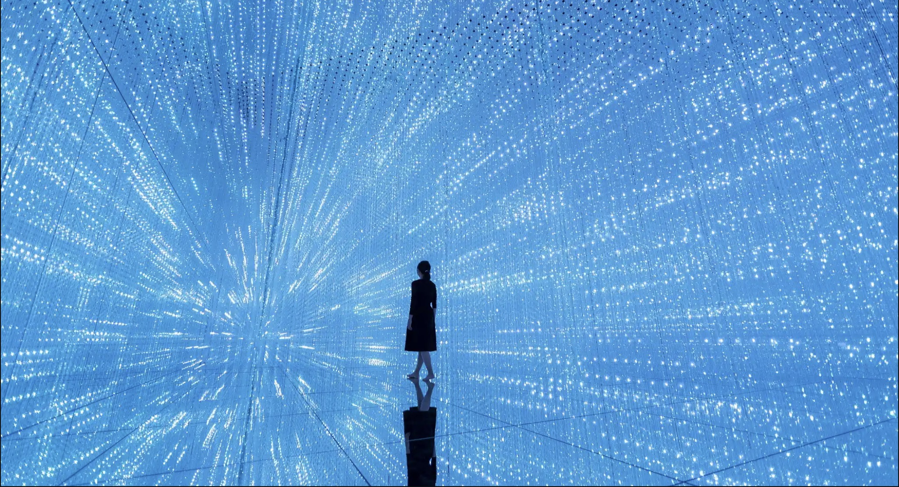
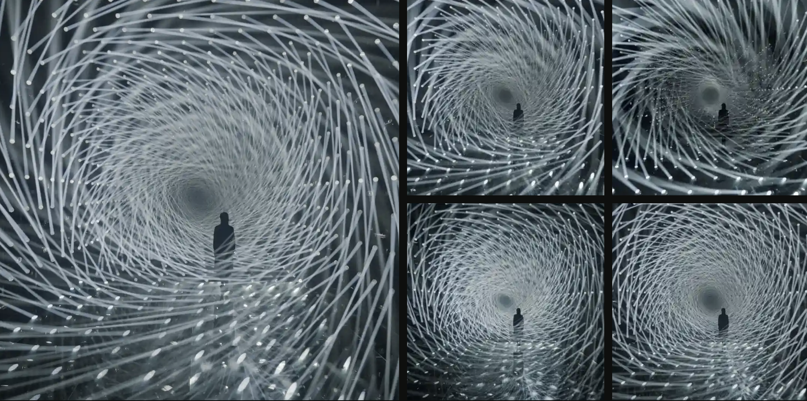
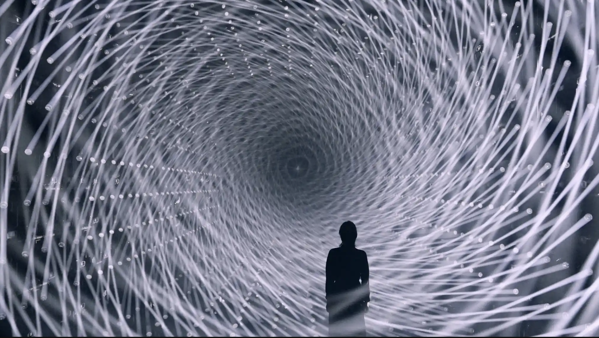

# zzha0182_9103_tut3_quiz8
## quiz 8 assignment

-** Imaging Technigue Inspiration **
I really like this work. The artist uses the accumulation of dots of different colors to create a painting. Here, light spots are used to create three-dimensional objects. The light sculpture extends infinitely in all directions. It gives people a sense of technology and futurism. I think this work of art can immerse the body in the artwork.

-** Technique Exploration Reference **
My imaging technique of choice is Orbit Control from p5.js, which allows the user to interactively adjust the viewpoint of a 3D scene, including rotation, translation, and zooming 2 with a mouse or touch screen. This technique was particularly inspiring for my project, as it provides an intuitive way to explore 3D Spaces, enhancing user immersion and engagement.
I would like to incorporate dynamic viewpoint control in my projects to give users the freedom to adjust the viewing Angle to gain a deeper understanding of the details and spatial relationships of artwork.
- [Technique link](https://p5js.org/examples/3d-orbit-control/)

